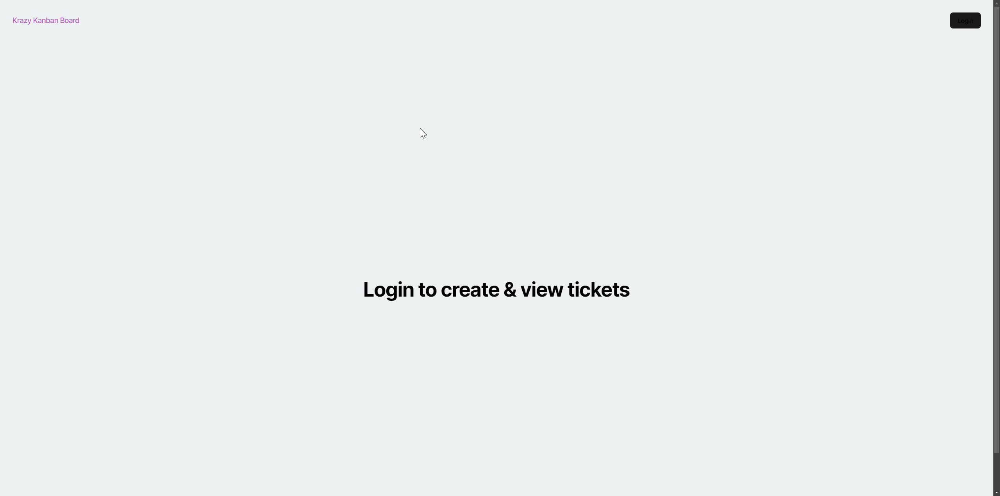

# Kanban Board

## Description
This project involves implementing JSON Web Tokens (JWTs) for a full-stack Kanban board application. JWTs are essential for ensuring secure communication between the client and server, enabling users to safely log in and interact with the site. Once a user logs in, they receive a token stored in local storage. This token grants them the ability to access and modify their personal Kanban board.

## Table of Contents
- [Installation](#installation)
- [Usage](#usage)
- [Features](#features)
- [Tests](#tests)
- [Questions?](#questions)

## Installation
To edit and update the Kanban board, users must first log in. After logging in, the user is granted a JWT, which allows them to securely interact with the application.

## Usage
Once logged in, users can:
- Create new tasks (or "items") on the Kanban board.
- Modify the priority of existing tasks by selecting and updating them.

## Features
- **JWT-based Authentication:** Secure login functionality that provides users with a token for protected actions.
- **Create Tasks:** Users can add new tasks to their Kanban board.
- **Edit Task Priority:** Users can change the priority of tasks to better organize their workflow.

## Tests
You can view and interact with the live Kanban board at the following link:
[Kanban Board](https://kanban-board-16wd.onrender.com)

## Questions?
Feel free to reach out with any questions:

- GitHub: [Durfey32](https://github.com/Durfey32)
- Email: [durfey_32@yahoo.com](mailto:durfey_32@yahoo.com)
